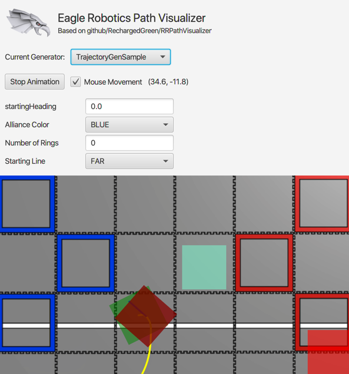

# Eagle Robotics Path Visualizer
**Based on github/RechargedGreen/RRPathVisualizer**

Welcome! This repository contains a visualizer for FIRST Tech Challenge teams to plan and animate paths for the
RoadRunner motion planning library. Originally developed by Recharged Green Robotics, this repository features additions
from Eagle Robotics to improve path development and user experience.

Key features:

- Visualization of multiple RoadRunner trajectory groups to plan for many autonomous scenarios and starting positions
- Mouse tracking to aid in coordinate selection along with animation controls
- Easy mirroring of field positions to visualize either alliance color using infix functions
- Reflection-based configuration system that lets users change trajectory settings (e.g. alliance color, starting
  position) without recompiling or restarting the application
- Sharing of configuration variables across different trajectories using application-level "environment" config

## How do I create a path?

The `TrajectoryGen` abstract class serves as the starting point for creating a custom trajectory. Create a new class
extending `TrajectoryGen` within the root-level `trajectories` package to get started.  
The `createTrajectory()` function must be implemented by each subclass and returns a list of trajectories. By default,
the robot starting pose is set to `(x=0, y=0, heading=0)`. To change this, set `startPose` to a new `Pose2d` instance as
the first action within the method. *It is better to set the starting pose within `createTrajectory()` rather than class
initialization, as this allows for configuration updates, as will be discussed later.* Additionally, instantiate a
new `ArrayList<Trajectory>` variable.

To get a `TrajectoryBuilder` object, call the superclass `builder()` function. Pass a value to optional
parameter `tangent` to set a custom starting tangent for the robot motion; otherwise, it will default to the current
robot heading. To conform to functional programming style, do not use variables; instead, call a series of functions on
the trajectory builder to add path elements.

When finished with a path, there are two options. Both of these options are custom for the path visualizer and will need
to be replaced when copying to robot code in Android Studio.

- Call the `saveAndBuild()` method on the trajectory builder. This will return a `Trajectory` object but will also
  update the known start pose to be the end point of the build trajectory. This ensures that trajectories can be built
  in a series without having to manually update the starting pose. With this new object, manually add it to the list
  created earlier.
- Call the `saveAndBuildTo(list: ArrayList<Trajectory>)` method, which performs the same actions as `saveAndBuild()` but
  also adds the built trajectory to the list passed to the function.

Finally, return the list created earlier in the function.

### Infix functions
The infix functions contained within the `TrajectoryGenUltimateGoal` class provide easy capability for changing robot position based on the current alliance color or robot starting position:
- Double.reverseIf(AllianceColor) flips the sign of a Double if the current alliance color matches the value passed to the function
- Double.reverseIf(StartingLine) flips the sign of a Double if the current starting line matches the value passed to the function

Ex. `6.0 reverseIf BLUE` returns `6.0` if the set alliance color is `RED` or `-6.0` if the set alliance color is `BLUE`.
The infix functions contained within the `TrajectoryGenUltimateGoal` class provide easy capability for changing robot position based on the current alliance color or robot starting position.  
 
## Viewing trajectories
Any Kotlin class extending `TrajectoryGen` and stored in the `trajectories` package will automatically be loaded upon application start.

Extend the `TrajectoryGenUltimateGoal` class to receive three built-in environment config variables that can be edited near the top of the application:
- Alliance color (red or blue)
- Starting line (closest to center or edge of field)
- Number of rings in starter stack
  
A drop-down menu at the top of the application can be used for swapping between the created trajectory generators.

## Annotations

### Config (for variables)

Add the `@Config` annotation to any `Int`, `Double`, `Boolean`, or `enum class` variable in the trajectory generator
class to be able to edit this variable during runtime.

Parameters:

- Name (String): Designate an alternate name for the config item that will be shown instead during runtime. This will also replace the variable name for matching the variable to the environment config.
- Environment (Boolean): If true, the annotated variable will be considered an "environment" variable. The value of this will be shared (and automatically updated) with all other variables with the same name and type across different trajectory generators.

### PrimaryTrajectory (for classes)

The first trajectory generator class found with the `@PrimaryTrajectory` annotation will be the first visualized upon
application start.

### Disabled (for classes)

Any trajectory generator class annotated with `@Disabled` will not be shown in the application.
